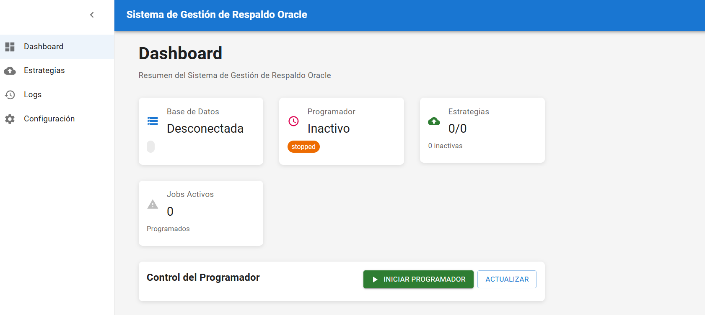

# Oracle Backup Management
Plataforma web full-stack para la automatización, ejecución y monitoreo de respaldos Oracle mediante RMAN.

## Descripción General
Oracle Backup Management es una aplicación web tipo Single Page Application (SPA) diseñada para administradores de bases de datos (DBAs), cuyo objetivo es automatizar completamente el ciclo de vida de los respaldos Oracle.

El sistema permite diseñar, programar, ejecutar y monitorear estrategias de respaldo de forma centralizada, reduciendo errores humanos, mejorando la trazabilidad y garantizando notificaciones automáticas ante cualquier evento crítico.

La plataforma integra:

- Un frontend SPA moderno en React
- Un backend robusto en FastAPI
- Integración directa con Oracle Scheduler y RMAN
- Bitácoras centralizadas y notificaciones por correo (SMTP)

## Objetivo del Sistema
- Automatizar la gestión de respaldos Oracle
- Permitir estrategias personalizadas y reutilizables
- Garantizar auditoría y trazabilidad completa
- Alertar de manera proactiva ante fallos o ejecuciones exitosas
- Centralizar configuración y monitoreo en una sola interfaz

## Tipos de Estrategias Soportadas
- Completo → Respaldo total de la base de datos
- Parcial → Respaldo de esquemas o tablas seleccionadas
- Incremental → Respaldo de cambios desde el último backup
- Personalizado → Estrategias avanzadas definidas por el usuario

## Características Principales
Diseño gráfico de estrategias de respaldo 
Asignación de prioridad y criticidad 
Integración con Oracle Scheduler 
Ejecución automática de comandos RMAN 
Validación del modo ARCHIVELOG 
Bitácora centralizada de ejecuciones 
Evidencias detalladas (fecha, duración, resultado) 
Exportación de logs (PDF / CSV) 
Notificaciones automáticas vía SMTP 
Gestión de configuración Oracle y SMTP 
Interfaz SPA moderna y reactiva 

## Tecnologías Utilizadas
### Backend

- Python 3
- FastAPI
- Uvicorn
- SQLAlchemy
- cx_Oracle
- APScheduler
- aiosmtplib
- Python Dotenv
- Arquitectura en Capas / Clean Architecture
- Oracle Scheduler
- RMAN

### Frontend

- Vite
- React Router
- Context API
- Custom Hooks
- CSS modular / global
- SPA (Single Page Application)

### Tooling

- Node.js
- npm
- Git & GitHub
- VS Code
- Oracle 19c+

## Arquitectura del Proyecto

El proyecto sigue una arquitectura Cliente-Servidor (Full Stack) claramente separada.
```bash
sistema-respaldos/
├── backend/     → API REST, lógica de negocio y orquestación
├── frontend/    → SPA React para gestión y monitoreo
```


### Backend (FastAPI)
El backend es responsable de:
- Orquestar la ejecución de respaldos
- Comunicarse con Oracle
- Programar tareas
- Registrar bitácoras
- Enviar notificaciones

### Estructura
```bash
backend/
├── app/
│   ├── api/            → Rutas REST
│   ├── core/           → Configuración, scheduler y email
│   ├── models/         → Entidades y esquemas
│   ├── repositories/  → Acceso a datos
│   ├── services/      → Lógica de negocio
│   └── utils/          → Utilidades
├── main.py             → Punto de entrada
├── requirements.txt
├── .env
```
### Componentes clave
- Routes: estrategias, logs, configuración del sistema
- Services: ejecución RMAN, scheduler, notificaciones
- Repositories: estrategias, logs, usuarios
- Core: configuración, email, programación automática

### Frontend (React SPA)
El frontend ofrece una interfaz gráfica moderna para configurar, ejecutar y monitorear respaldos.
```bash
frontend/
├── src/
│   ├── api/           → Comunicación con backend
│   ├── components/    → UI reutilizable
│   ├── context/       → Estado global
│   ├── hooks/         → Hooks personalizados
│   ├── pages/         → Vistas principales
│   ├── styles/        → Estilos
│   ├── utils/         → Utilidades
│   ├── App.jsx
│   └── index.js
```
Pantallas principales:
- Dashboard
- Gestión de Estrategias de Respaldo
- Programación de Tareas
- Bitácoras y Auditoría
- Configuración del Sistema
- Advertencia modo ARCHIVELOG

## Requisitos Previos

Asegúrate de tener instalado:
### Backend
- Python 3.x
- Oracle Client
- Oracle 19c+
- Rust (para dependencias)
- Acceso a Oracle Scheduler y RMAN

### Frontend
- Node.js >= 18
- npm / yarn / pnpm

## Instalación
1. Clonar el repositorio

```bash
git clone https://github.com/sebastian-alpizar/oracle-backup-managemen.git
cd oracle-backup-managemen
```

### Configuración del Backend

2. Crear entorno virtual
```bash
cd backend
python -m venv venv
venv\Scripts\activate
```

3. Instalar dependencias
```bash
pip install -r requirements.txt
```

4. Configurar variables de entorno (.env)
```bash
ORACLE_USER=system
ORACLE_PASSWORD=tu_password
ORACLE_DSN=localhost:1521/XE

SMTP_SERVER=smtp.gmail.com
SMTP_PORT=465
SMTP_USERNAME=correo@gmail.com
SMTP_PASSWORD=app_password
NOTIFICATION_EMAIL=correo@gmail.com

DEBUG=True
BACKUP_BASE_PATH=./backups
RETENTION_DAYS=30
```

5. Ejecutar backend
```bash
uvicorn main:app --reload
```
Backend disponible en:
http://127.0.0.1:8000

### Configuración del Frontend
6. Instalar dependencias
```bash
cd frontend
npm install
```

7. Ejecutar Frontend:
```bash
npm run dev
```
El frontend se ejecutará típicamente en:
http://localhost:5173

## Comunicación del Sistema

Flujo General

- El DBA crea una estrategia de respaldo
- Define tipo, prioridad y calendario
- El sistema valida ARCHIVELOG
- Oracle Scheduler ejecuta la tarea
- RMAN realiza el respaldo
- Se registra la bitácora
- Se envía notificación automática
- El DBA consulta resultados en tiempo real

## Ejemplos Visuales


## Despliegue

**Backend** 

- VPS / EC2 / On-Premise
- Oracle Client instalado
- Variables de entorno seguras
- Uvicorn + Supervisor / Docker (opcional)

**Frontend (React)**
```bash
npm run build
```
Publicar `/build` o `/dist` en:
- Netlify
- Vercel
- Render
- GitHub Pages

## Autor

**Desarrollado por Sebastián Alpízar Porras**  
GitHub: https://github.com/sebastian-alpizar  
Email: sebastianalpiz@gmail.com
